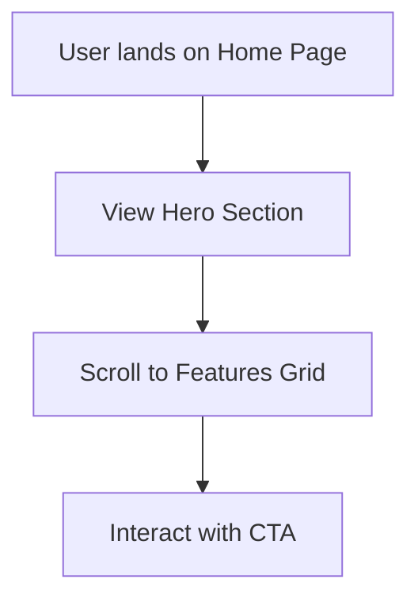

## 1. Product Overview
A modern, production-ready Next.js starter project designed as a striking landing page.
- It provides a solid foundation for building high-performance web applications, solving the "blank canvas" problem with a beautiful, fully responsive, and accessible UI.
- The target value is to accelerate development while delivering exceptional, non-generic aesthetics out of the box.

## 2. Core Features

### 2.1 User Roles
Not applicable for this static/client-side starter template.

### 2.2 Feature Module
1. **Landing Page**: Hero section with dynamic typography, feature grid, and a call-to-action (CTA) footer.
2. **About/Showcase Section**: A visually engaging area to display content or product details.

### 2.3 Page Details
| Page Name | Module Name | Feature description |
|-----------|-------------|---------------------|
| Home page | Hero section | High-impact headline, engaging subtitle, and primary CTA buttons with subtle motion. |
| Home page | Features Grid | Bottom-up staggered reveal of core features using modern card layouts. |
| Home page | Footer | Clean, minimal footer with links and a secondary CTA. |

## 3. Core Process
Users arrive at the landing page, consume the value proposition in the hero section, scroll down to discover features, and are guided toward the call-to-action.

## 4. User Interface Design
### 4.1 Design Style
- **Aesthetic**: Brutalist-inspired minimalism with high contrast and refined typography.
- **Colors**: Deep charcoal background (`#0a0a0a`) with stark white text (`#ffffff`) and a vibrant accent color (e.g., neon electric blue `#00f0ff` or sharp violet).
- **Typography**: A bold, geometric sans-serif for headings (e.g., 'Space Grotesk' or 'Clash Display' via Google Fonts) paired with a clean sans-serif for body text (e.g., 'Inter').
- **Layout style**: Asymmetric, generous negative space, large typography, overlapping elements.
- **Motion**: Subtle CSS transitions on hover, staggered entrance animations on scroll.

### 4.2 Page Design Overview
| Page Name | Module Name | UI Elements |
|-----------|-------------|-------------|
| Home page | Hero section | Oversized typography, gradient mesh or noise texture background, pill-shaped buttons. |
| Home page | Features | Grid of cards with subtle borders, glowing hover effects, minimal icons. |

### 4.3 Responsiveness
Desktop-first design, scaling down fluidly to mobile with stacked layouts and touch-friendly tap targets.
