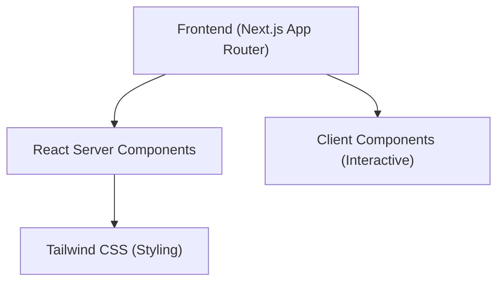

## 1. Architecture Design

## 2. Technology Description
- **Frontend Framework**: Next.js 14+ (App Router)
- **UI Library**: React 18+
- **Styling**: Tailwind CSS 3+
- **Language**: TypeScript
- **Icons**: Lucide React
- **Animation**: Framer Motion (for staggered reveals and smooth transitions)
- **Initialization Tool**: `npx create-next-app@latest`

## 3. Route Definitions
| Route | Purpose |
|-------|---------|
| `/` | Main landing page containing hero, features, and CTA. |

## 4. API Definitions
No backend APIs required for the initial static starter.

## 5. Server Architecture Diagram
Not applicable (Frontend-only starter).

## 6. Data Model
Not applicable.
